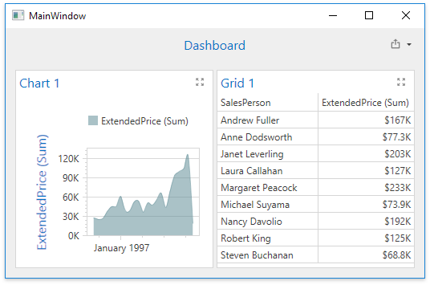

<!-- default badges list -->

<!-- default badges end -->
# Dashboard for WPF - How to bind a dashboard to a Microsoft SQL Server database file

This example shows how to bind a dashboard to a Microsoft SQL Server database file (*.mdf).

The dashboard and the data source are created at runtime. The dashboard data source is an instance of the [DashboardSqlDataSource](https://docs.devexpress.com/Dashboard/DevExpress.DashboardCommon.DashboardSqlDataSource) object with a [SelectQuery](https://docs.devexpress.com/CoreLibraries/DevExpress.DataAccess.Sql.SelectQuery) to retrieve data. The data source is added to the [Dashboard.DataSources](https://docs.devexpress.com/Dashboard/DevExpress.DashboardCommon.Dashboard.DataSources) collection. The data source connection parameters are not specified at this time. 

The dashboard is assigned to the [DashboardControl.DashboardSource](https://docs.devexpress.com/Dashboard/DevExpress.DashboardWpf.DashboardControl.Dashboard) property in the `Window_Loaded` event handler. 

Before loading data, the dashboard control fires the [DashboardControl.ConfigureDataConnection](https://docs.devexpress.com/Dashboard/DevExpress.DashboardWpf.DashboardControl.ConfigureDataConnection) event. A connection string for the _NorthWind_ database file is assigned to the [CustomStringConnectionParameters.ConnectionString](https://docs.devexpress.com/CoreLibraries/DevExpress.DataAccess.ConnectionParameters.CustomStringConnectionParameters.ConnectionString) property accessible with the [e.ConnectionParameters](https://docs.devexpress.com/CoreLibraries/DevExpress.DataAccess.Sql.ConfigureDataConnectionEventArgs.ConnectionParameters) property. Note that the property returns an object of the base class - you should cast it to the `CustomStringConnectionParameters` type.

Subsequently the data source is filled with data automatically, and the dashboard displays the data.

## Files to Review:

* [MainWindow.xaml.cs](./CS/WpfDashboard_SqlDataSource/MainWindow.xaml.cs) (VB: [MainWindow.xaml.vb](./VB/WpfDashboard_SqlDataSource/MainWindow.xaml.vb))

## Documentation

- [WPF Dashboard Viewer - Provide Data](https://docs.devexpress.com/Dashboard/119901/wpf-viewer/providing-data)
- [Visual Studio Designer - Provide Data](https://docs.devexpress.com/Dashboard/18295/wpf-viewer/create-dashboards-in-the-visual-studio-designer/provide-data)
